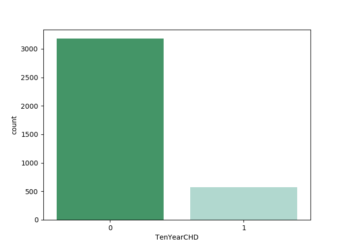
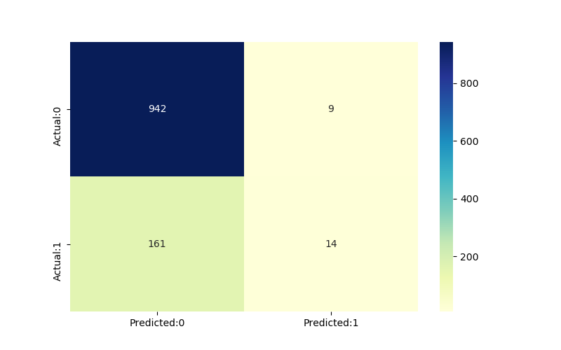

# HeartDisease_Prediction_and_Evaluation

World Health Organization has estimated that four out of five cardiovascular diseases(CVD) deaths are due to heart attacks .
This whole research intends to pinpoint the ratio of patients who possess a good chance of being affected by CVD and also to predict the overall risk using Logistic Regression .

### What is Logistic Regression ?
[Logistic Regression](https://machinelearningmastery.com/logistic-regression-for-machine-learning/) is a statistical and machine-learning techniques classifying records of a dataset based on the values of the input fields . It predicts a dependent variable based on one or more set of independent variables to predict outcomes .
It can be used both for binary classification and multi-class  classification .

### Ten Year's CHD Record of all the patients available in the dataset :

### Counting number of patients affected by CHD where (0= Not Affected ; 1= Affected) :

### Evaluation and Acuuracy of the model using Confusion Matrix :

### Dataset,Data's Shape,Counting number of male effected by CHD,Splitting of the Data (Training and Testing Set) and Classification Report of the Confusion Matrix :

### _Programming Language used in the project is :_
1. Python 

### _Packages-to-install :_

 * pandas
 * pylab
 * matplotib
 * sklearn
 * seaborn
 * statsmodel
 * numpy
 * scipy
 
 
